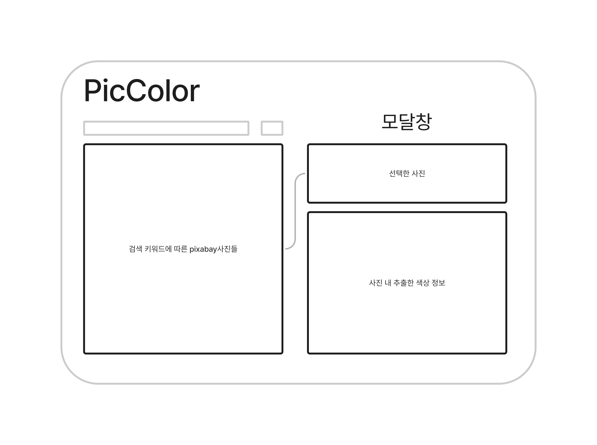

# picColor

## UI Draft

## 사용 기술

 

## 구현하고자 하는 기능

### 전부 구현할 필요는 없음

1. pixabay 와 같은 무료 이미지 검색 api 를 사용해 이미지 검색 기능 (option)
2. 검색 후 이미지 리스트에서 원하는 이미지를 클릭하면 해당 이미지 모달 창 (option)
3. [모달창] (essential)
    
   (상단) 클릭한 이미지  
   (하단) 이미지 내 색상 클릭 시 색상 정보 + 해당 색상과 어울리는 색 리스트 테이블

4. 색상 정보 복사 기능 (essential)
